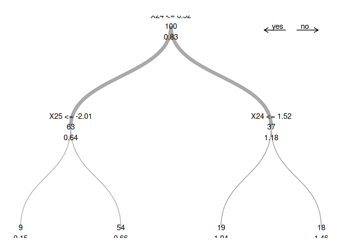

<!-- README.md is generated from README.Rmd. Please edit that file -->

# SDModels <a href="https://www.markus-ulmer.ch/SDModels/"></a>

<!-- badges: start -->

[](https://CRAN.R-project.org/package=SDModels)
[](https://github.com/markusul/SDModels/actions/workflows/R-CMD-check.yaml)

<!-- badges: end -->

Spectrally Deconfounded Models (SDModels) is a package with methods to
screen for and analyze non-linear sparse direct effects in the presence
of unobserved confounding using the spectral deconfounding techniques
(Ćevid, Bühlmann, and Meinshausen (2020), Guo, Ćevid, and Bühlmann
(2022)). These methods have been shown to be a good estimate for the
true direct effect if we observe many covariates, e.g., high-dimensional
settings, and we have fairly dense confounding. Even if the assumptions
are violated, it seems like there is not much to lose, and the SDModels
will, in general, estimate a function closer to the true one than
classical least squares optimization. SDModels provides software for
Spectrally Deconfounded Additive Models (SDAMs) (Scheidegger, Guo, and
Bühlmann (2025)) and Spectrally Deconfounded Random Forests
(SDForest)(Ulmer, Scheidegger, and Bühlmann (2025)).


## Installation

To install the SDModels R package from CRAN, just run

``` r
install.packages(SDModels)
```

You can install the development version of SDModels from
[GitHub](https://github.com/) with:

``` r
# install.packages("devtools")
devtools::install_github("markusul/SDModels")
```

or

``` r
# install.packages('pak')
pak::pkg_install('markusul/SDModels')
```

## Usage

This is a basic example on how to estimate the direct effect of $X$ on
$Y$ using SDForest. You can learn more about analyzing sparse direct
effects estimated by SDForest in the article
[SDForest](https://www.markus-ulmer.ch/SDModels/articles/SDForest.html).

``` r
library(SDModels)

set.seed(42)
# simulation of confounded data
sim_data <- simulate_data_nonlinear(q = 2, p = 50, n = 100, m = 2)
X <- sim_data$X
Y <- sim_data$Y
train_data <- data.frame(X, Y)
# parents
sim_data$j
#> [1] 25 24

fit <- SDForest(Y ~ ., train_data)
fit
#> SDForest result
#> 
#> Number of trees:  100 
#> Number of covariates:  50 
#> OOB loss:  0.1556413 
#> OOB spectral loss:  0.05254942
```

You can also estimate just one Spectrally Deconfounded Regression Tree
using the `SDTree` function. See also the article
[SDTree](https://www.markus-ulmer.ch/SDModels/articles/SDTree.html).

``` r
Tree <- SDTree(Y ~ ., train_data, cp = 0.03)

# plot the tree
Tree
#> $predictions
#>   [1] 0.6609876 0.6609876 0.6609876 1.0367566 0.6609876 0.6609876 0.6609876
#>   [8] 0.1522660 0.6609876 0.6609876 0.6609876 0.6609876 1.0367566 1.4551242
#>  [15] 1.4551242 0.6609876 0.6609876 1.4551242 1.0367566 0.6609876 0.1522660
#>  [22] 0.6609876 1.0367566 0.6609876 1.0367566 1.0367566 0.6609876 0.6609876
#>  [29] 0.1522660 1.4551242 0.1522660 1.4551242 1.4551242 1.0367566 1.4551242
#>  [36] 0.6609876 0.6609876 1.4551242 1.0367566 0.6609876 1.4551242 1.0367566
#>  [43] 1.0367566 0.6609876 1.0367566 0.6609876 0.6609876 1.4551242 0.1522660
#>  [50] 0.6609876 0.6609876 0.6609876 1.0367566 0.6609876 1.4551242 0.6609876
#>  [57] 1.0367566 0.6609876 0.6609876 0.1522660 1.0367566 0.6609876 1.0367566
#>  [64] 0.1522660 0.6609876 0.6609876 1.4551242 0.6609876 0.6609876 1.4551242
#>  [71] 1.4551242 0.6609876 0.6609876 1.0367566 0.6609876 1.4551242 0.6609876
#>  [78] 0.6609876 0.6609876 1.0367566 0.6609876 0.6609876 1.4551242 0.6609876
#>  [85] 0.6609876 0.6609876 0.6609876 0.6609876 0.6609876 0.1522660 0.6609876
#>  [92] 1.0367566 1.4551242 1.4551242 0.6609876 0.6609876 0.1522660 0.6609876
#>  [99] 1.0367566 0.6609876
#> 
#> $tree
#>      name left right  j          s     value      dloss  res_dloss         cp
#> [1,]    1    2     3 24  0.5186858 0.8295434 0.09719892 0.03323101 10.0000000
#> [2,]    1    4     5 25 -2.0062213 0.6418912 0.03323101 0.01140406  0.3418866
#> [3,]    2    6     7 24  1.5229617 1.1821439 0.03323101 0.01261921  0.3418866
#> [4,]    1    0     0  0  0.0000000 0.1522660 0.01140406 0.00000000  0.1173270
#> [5,]    3    0     0  0  0.0000000 0.6609876 0.01140406 0.00000000  0.1173270
#> [6,]    2    0     0  0  0.0000000 1.0367566 0.01261921 0.00000000  0.1298287
#> [7,]    4    0     0  0  0.0000000 1.4551242 0.01261921 0.00000000  0.1298287
#>      n_samples leaf
#> [1,]       100    2
#> [2,]        63    2
#> [3,]        37    2
#> [4,]         9    1
#> [5,]        54    1
#> [6,]        19    1
#> [7,]        18    1
#> 
#> $var_names
#>  [1] "X1"  "X2"  "X3"  "X4"  "X5"  "X6"  "X7"  "X8"  "X9"  "X10" "X11" "X12"
#> [13] "X13" "X14" "X15" "X16" "X17" "X18" "X19" "X20" "X21" "X22" "X23" "X24"
#> [25] "X25" "X26" "X27" "X28" "X29" "X30" "X31" "X32" "X33" "X34" "X35" "X36"
#> [37] "X37" "X38" "X39" "X40" "X41" "X42" "X43" "X44" "X45" "X46" "X47" "X48"
#> [49] "X49" "X50"
#> 
#> $var_importance
#>         X1         X2         X3         X4         X5         X6         X7 
#> 0.00000000 0.00000000 0.00000000 0.00000000 0.00000000 0.00000000 0.00000000 
#>         X8         X9        X10        X11        X12        X13        X14 
#> 0.00000000 0.00000000 0.00000000 0.00000000 0.00000000 0.00000000 0.00000000 
#>        X15        X16        X17        X18        X19        X20        X21 
#> 0.00000000 0.00000000 0.00000000 0.00000000 0.00000000 0.00000000 0.00000000 
#>        X22        X23        X24        X25        X26        X27        X28 
#> 0.00000000 0.00000000 0.04585022 0.01140406 0.00000000 0.00000000 0.00000000 
#>        X29        X30        X31        X32        X33        X34        X35 
#> 0.00000000 0.00000000 0.00000000 0.00000000 0.00000000 0.00000000 0.00000000 
#>        X36        X37        X38        X39        X40        X41        X42 
#> 0.00000000 0.00000000 0.00000000 0.00000000 0.00000000 0.00000000 0.00000000 
#>        X43        X44        X45        X46        X47        X48        X49 
#> 0.00000000 0.00000000 0.00000000 0.00000000 0.00000000 0.00000000 0.00000000 
#>        X50 
#> 0.00000000 
#> 
#> attr(,"class")
#> [1] "SDTree"
plot(Tree)
```



Or you can estimate a Spectrally Deconfounded Additive Model, with
theoretical guarantees, using the `SDAM` function. See also the article
[SDAM](https://www.markus-ulmer.ch/SDModels/articles/SDAM.html).

``` r
model <- SDAM(Y ~ ., train_data)
#> [1] "Initial cross-validation"
#> [1] "Second stage cross-validation"

model
#> SDAM result
#> 
#> Number of covariates:  50 
#> Number of active covariates:  4
```

<div id="refs" class="references csl-bib-body hanging-indent"
entry-spacing="0">

<div id="ref-Cevid2020SpectralModels" class="csl-entry">

Ćevid, Domagoj, Peter Bühlmann, and Nicolai Meinshausen. 2020.
“<span class="nocase">Spectral Deconfounding via Perturbed Sparse Linear
Models</span>.” *J. Mach. Learn. Res.* 21 (1).
<http://jmlr.org/papers/v21/19-545.html>.

</div>

<div id="ref-Guo2022DoublyConfounding" class="csl-entry">

Guo, Zijian, Domagoj Ćevid, and Peter Bühlmann. 2022.
“<span class="nocase">Doubly debiased lasso: High-dimensional inference
under hidden confounding</span>.” *The Annals of Statistics* 50 (3).
<https://doi.org/10.1214/21-AOS2152>.

</div>

<div id="ref-scheidegger2023spectral" class="csl-entry">

Scheidegger, Cyrill, Zijian Guo, and Peter Bühlmann. 2025. “Spectral
Deconfounding for High-Dimensional Sparse Additive Models.” *ACM / IMS
J. Data Sci.* <https://doi.org/10.1145/3711116>.

</div>

<div id="ref-ulmer2025spectrallydeconfoundedrandomforests"
class="csl-entry">

Ulmer, Markus, Cyrill Scheidegger, and Peter Bühlmann. 2025. “Spectrally
Deconfounded Random Forests.” <https://arxiv.org/abs/2502.03969>.

</div>

</div>
